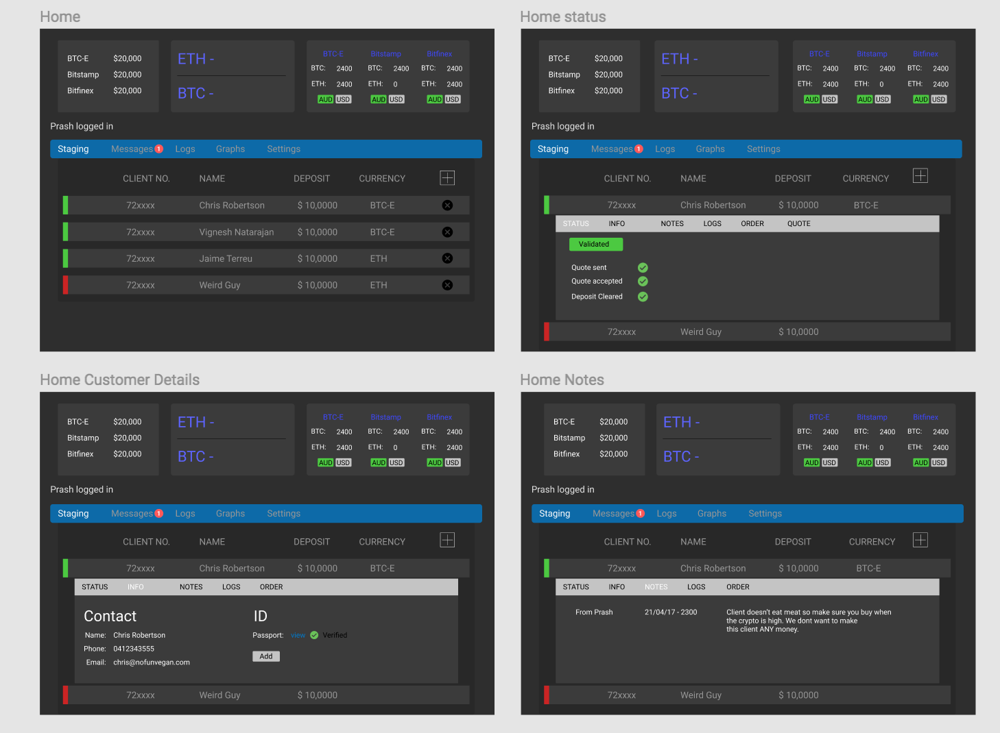
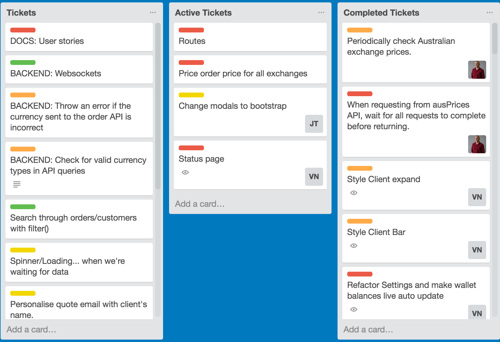
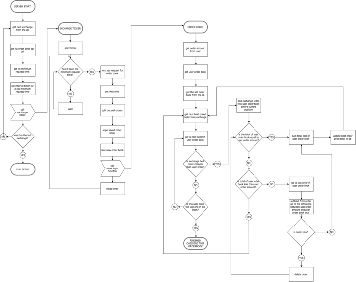

# draupnir
A tool for calculating the best price of cryptocurrencies over multiple exchanges.

# The Client 
Caleb and Brown is a brokering business that purchases crypto currency on behalf of their customers. In essence, a customer makes contact with Caleb and Brown and informs them how much fiat money they wish to convert to crypto. Caleb and Brown go through a KYC procedure and then purchase those coins on their cusomters behalf, typically on international exchanges. Market analysis is essential for our clients to get the best price for the crypto, as it differs, sometimes quite dramatically. 

# The Problem
Our clients have manually been analysisng the price of crypto as well as hand crafting quotes for their clients. On top of this our clients have no efficient way of keeping a history of purchases they make on their customers behlaf. The actual purchasing of crypto currency from foreign echanges is also done manually. Whilst this process can be automated by Draupnir, we felt it best to not do automatic transfers given the immaturity of the software.

# The Solution
Enter dRAUPNIR. 

# Wireframes
[Click Here](https://www.figma.com/file/YhWTBjSYBwVhk6C05kiYyhmz/Caleb-%26-Brown) to view all our wireframes


# Trello
We implemented an agile methodology by making extensive use of [Trello](https://trello.com/b/z0TEjE2X/term3-projectchris-jaime-vig)



# Live Web App

```
https://draupnir.netlify.com
```


To login

- Scan the following qr code onto google authenticator(you will need to download it from the app store onto your phone)
- username: bat@man.com
- password: password
- enter the otp from google authenticator


# Backend

Draupnir is running a Node.js server with Express routing and a MongoDB database.

The backend performs a number of tasks, including;
- Fetching foreign exchange rates
- Fetching cryptocurrency live price ticker data from various exchanges
- Creating pdf quotes and emailing them to customers
- Fetching cryptocurrency prices from Australian exchanges
- Authenticating users

One of the major functions of the backend API is to calculate the most cost effective orders to purchase over multiple exchanges, given certain information.

The logic for this order calculation changed dramatically over the span of the project, as more use cases and scenarios became apparent from our process of testing and running user flow analysis.

The current logic flow of the order calculator is outlined below.

If a customer wants to purchase $10,000 of Bitcoin, the following logic steps are executed:
1. The front end sends a get request to the API with a large query string. Details of which are below.
2. The API sends out fetch requests to all of the configured exchanges and receives their complete order books.
3. As every exchange formats their API response differently, the responses have to be transformed into a uniform structure.
4. Once all of the exchanges have returned their orders, they are combined into a single list.
5. Every order is looked at, starting with the cheapest. For each order, various factors are considered:
    - Has the total required order amount already been filled?
    - Does the exchange have funds remaining in its float?
    - Can we take all or just part of the order?
6. When the order total has been fulfilled this way, it tallies how much is being purchased from each exchange.
7. USD to AUD exchange rates are fetched, and all prices are converted into AUD.
8. Both USD and AUD figures are returned to the front end.

There are a lot of different use cases and edge cases that need to be taken into account when calculating the optimal order.
- The user is able to specify if they want to purchase up to an amount of USD, or up to an amount of cryptocurrency. For example, they can ask for $10,000 worth of Bitcoin or 5 Bitcoins. This affects how the calculations are performed.
- The brokers using Draupnir will have different amounts of funds available on exchanges at different times. These floats need to be taken into account for each order, so as to not advise the user to make purchases on an exchange where they don't have the funds to cover it.
- It is possible to only take a part of a single order from an exchange. For example, if the client has asked for 2 Bitcoin, and there is an order on the exchange selling 4 Bitcoin, we can take just half of the order. This is taken into account to allow us to fill user order amounts exactly to the cent.

# Exchange Comparison Logic Flow



## Issues and Improvements
The order API could be improved in many ways.

The HTTP method could be changed to POST, and all of the information currently being passed in the query string can be sent in the body in a standard JSON format.

The API could initially perform health checks on all of the external exchange APIs. This would allow us to only add exchanges that are responding to be added to the call queue and would let us give the user's error information when exchanges are down.

Currently, we only use the public APIs from the cryptocurrency exchanges. These exchanges all provide authenticated APIs that allow you to perform various trades. This tool could be extended to allow automatic trading. This would of course greatly increase financial risks from any errors in the code and would need to be carefully tested.

## Order API Breakdown<hr/>
### URL
`http://localhost:8000/api/order?buying=btc&tally=usd&amount=20000&btceLimit=5000&bitstampLimit=5000&bitfinexLimit=5000`

### Queries:
  - **buying**
    - string
    - currency that this order wants to purchase
    - Example: ?buying=btc
  - **tally**
    - string
    - currency to tally the order by i.e. do you want 5 btc or 10000 worth?
    - Example: ?tally=usd
  - **amount**
    - integer
    - amount of buying currency to tally to i.e how much do you want?
    - Example: ?amount=10000
  - **btceLimit**
    - integer
    - maximum amount (in usd) that can be purchases from BTC-e exchange
    - Example: ?btceLimit=5000
  - **bitstampLimit**
    - integer
    - maximum amount (in usd) that can be purchases from Bitstamp exchange
    - Example: ?bitstampLimit=5000
  - **bitfinexLimit**
    - integer
    - maximum amount (in usd) that can be purchases from Bitfinex exchange
    - Example: ?bitfinexLimit=5000

### Example API Calls<hr/>
**Purchase 5 BTC at best price, with USD$5000 limit on each exchange**

`http://localhost:8000/api/order?buying=btc&tally=btc&amount=5&btceLimit=5000&bitstampLimit=5000&bitfinexLimit=5000`

**Purchase USD$10,000 worth of Ether with USD$0 on BTC-e and USD$20,000 on each of the other exchanges**

`http://localhost:8000/api/order?buying=eth&tally=usd&amount=10000&btceLimit=0&bitstampLimit=20000&bitfinexLimit=20000`

## Dependencies used<hr />

- axios
- body-parser
- busboy-body-parser
- cors
- dotenv
- express
- fs": "^
- jsonwebtoken
- jwt-decode
- lodash
- mailgun-js
- mongoose
- morgan
- multer
- multer-imager
- node-fetch
- passport
- passport-2fa-totp
- passport-jwt
- passport-local
- passport-local-mongoose
- path
- pdfkit
- qrcode
- react-dropzone
- shortid
- speakeasy


# Frontend

The frontend was built using react.js which communicates with our api and renders interactive and dynamic templates. 

Most of the business logic comes from our server, and react does a very good job of acting as a messenger which carries input to and from the api. 

We went for a very lightweight approach by managing the state that react depends upon to render components at the highest possible level, and all subcomponents are just functional and stateless. By doing this we only had to worry about handlers at the top most levels and just pass on the necessery obects to the respective components.

We also used bootstrap to style the entire project. Flexbox has been heavily used and we also managed to implement CSS grid for a few components.

## Issues and Improvements<hr />
The only real issue with using react has been the cumbersome experience of manage state. Since our project has grown in size it is a highly repetetive effort to keep passing state vertially through the compenents. A future fix might be to use MobX or Redux to manage the state.

## Dependencies used<hr />

- axios
- babel-cli
- babel-plugin-lodash
- babel-preset-env
- event-emitter
- fbemitter
- jwt-decode
- lodash
- mailgun-js
- moment
- pdfmake
- react
- react-bootstrap
- react-collapse
- react-dom
- react-dropzone
- react-icons
- react-loader
- react-modal
- react-moment
- react-motion
- react-number-format
- react-numeric-input
- react-router-dom
- react-scripts
- react-transition


